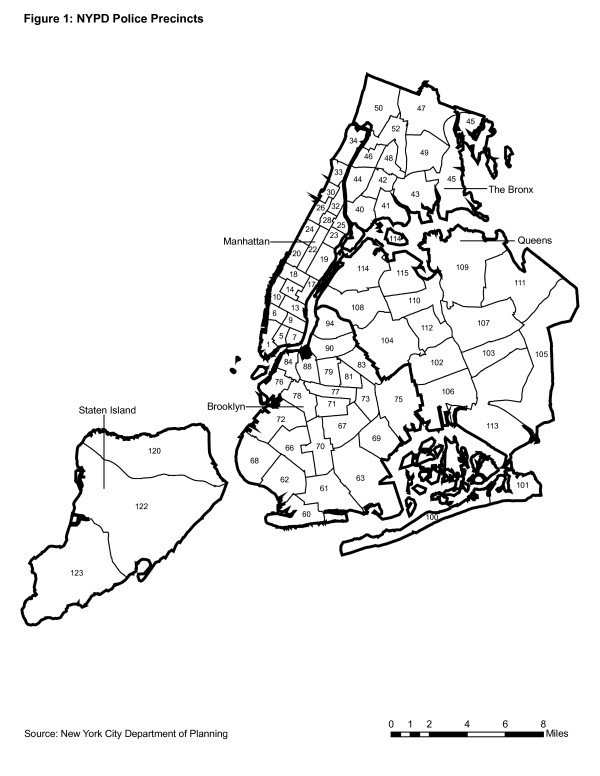

# Results
```{r results='hide',warning=FALSE}
library(tidyverse)
library(patchwork)
library(reshape2)
library(mi)
library(readr)
library(lubridate)
library(extracat)
library(ggplot2)
library(dplyr)
library(vcd)
library(RColorBrewer)
library(ggmosaic)
library(ggmap)
library(ggplot2)
library(tidyr)
library(cowplot)
library(httr)
library(rgdal)
library(tigris)
library(dplyr)
library(broom)
options(dplyr.summarise.inform=FALSE)
```

## Arrest data analysis of NYC from 2006 to 2021

```{r }
nyc<- read_csv('NYPD_Arrests_Data__Historic_.csv')
nyc<- nyc%>%mutate(ARREST_DATE=as.Date(nyc$ARREST_DATE,format='%m/%d/%Y'))

nyc2021<-read_csv('NYPD_Arrest_Data__Year_to_Date_.csv')
nyc2021<-nyc2021%>%mutate(ARREST_DATE=as.Date(nyc2021$ARREST_DATE,format='%m/%d/%Y'))
colnames(nyc2021)[19]<- "Lon_Lat" 
nyc<-rbind(nyc,nyc2021)

nyc<- nyc%>%mutate(ARREST_YEAR= year(nyc$ARREST_DATE))

```

### Total Number of Crimes

```{r,fig.width = 8, fig.height = 5}
options(scipen=10000)

crime_total <- count(nyc,ARREST_YEAR)
crime_total$Total <- crime_total$n

crime_total$ARREST_YEAR <- as.Date(ISOdate(crime_total$ARREST_YEAR, 1, 1))

ggplot(crime_total,aes(x=ARREST_YEAR,y=Total)) + 
  geom_bar(stat = "identity") +
  scale_x_date(limits = c(as.Date("2005-01-01"), as.Date("2022-01-01")),date_breaks = "1 year", date_labels = "%y") +
  theme_grey(16) + 
  ggtitle("Total number of Crimes in NYC over Years")
```
From the above figure, we can see that from 2006 to 2010, the total number of crimes in New York City has been increasing every year, with the largest increase in 2007 and 2009, at about 25,000. The number of crimes has been declining every year since 2010, with the largest decrease in 2020 of approximately 75,000 compared to 2019.

### Classification of Crimes

```{r}
data10 <- nyc %>% filter(year(ARREST_DATE)<2011)
data11 <- nyc %>% filter(year(ARREST_DATE)<2012&year(ARREST_DATE)>=2011)
data12 <- nyc %>% filter(year(ARREST_DATE)<2013&year(ARREST_DATE)>=2012)
data13 <- nyc %>% filter(year(ARREST_DATE)<2014&year(ARREST_DATE)>=2013)
data14 <- nyc %>% filter(year(ARREST_DATE)<2015&year(ARREST_DATE)>=2014)
data15 <- nyc %>% filter(year(ARREST_DATE)<2016&year(ARREST_DATE)>=2015)
data16 <- nyc %>% filter(year(ARREST_DATE)<2017&year(ARREST_DATE)>=2016)
data17 <- nyc %>% filter(year(ARREST_DATE)<2018&year(ARREST_DATE)>=2017)
data18 <- nyc %>% filter(year(ARREST_DATE)<2019&year(ARREST_DATE)>=2018)
data19 <- nyc %>% filter(year(ARREST_DATE)<2020&year(ARREST_DATE)>=2019)
data20 <- nyc %>% filter(year(ARREST_DATE)<2021&year(ARREST_DATE)>=2020)
data21 <- nyc %>% filter(year(ARREST_DATE)>=2021)
```
In this data set provided by the NYPD, each arrested crime corresponds to two categories, **OFNS_DESC** and **PD_DESC**. **OFNS_DESC** is the description of internal classification which is more general. **PD_DESC** is the description of internal classification which is more granular than **OFNS_DESC**. We draw Mosaic chart, line chart and Cleveland dot plot for this two categories.

#### General Category(OFNS_DESC)

Due to the large number of types in **OFNS_DESC**, we only take the 30 most numerous types. We divide the 15-year data into three five-year data and draw a graph to see the changes in the distribution of **OFNS_DESC**.

```{r,fig.width = 8, fig.height = 15}
five_year1 <- nyc %>% filter(year(ARREST_DATE)<2011&year(ARREST_DATE)>=2006)
five_year2 <- nyc %>% filter(year(ARREST_DATE)<2016&year(ARREST_DATE)>=2011)
five_year3 <- nyc %>% filter(year(ARREST_DATE)<2021&year(ARREST_DATE)>=2016)

five_year1 <- count(five_year1,OFNS_DESC)
five_year1_top <- top_n(five_year1,30)

five_year2 <- count(five_year2,OFNS_DESC)
five_year2_top <- top_n(five_year2,30)

five_year3 <- count(five_year3,OFNS_DESC)
five_year3_top <- top_n(five_year3,30)

f1<-ggplot(five_year1_top,aes(x=n,y=reorder(OFNS_DESC,n)))+
  geom_point(color = 'blue')+
  ylab("Crime")+
  xlab("Count")+
  ggtitle("30 Most Numerous Crimes From 2006 to 2010")

f2<-ggplot(five_year2_top,aes(x=n,y=reorder(OFNS_DESC,n)))+
  geom_point(color = 'blue')+
  ylab("Crime")+
  xlab("Count")+
  ggtitle("30 Most Numerous Crimes From 2011 to 2015")

f3<-ggplot(five_year3_top,aes(x=n,y=reorder(OFNS_DESC,n)))+
  geom_point(color = 'blue')+
  ylab("Crime")+
  xlab("Count")+
  ggtitle("30 Most Numerous Crimes From 2016 to 2020")

plot_grid(f1,f2,f3, nrow = 3, ncol = 1, align = "hv",axis = 'l' )
```

From the three Cleveland Dot Plots above, we can find that although the total number of crimes has dropped, **DANGEROUS DRUGS**, **ASSAULT 3** are still the two types of most numerous crimes. But the difference between these two types is gradually decreasing. From 2006 to 2010, **CRIMINAL TRESPASS** was still a serious problem, but after 2010, the number of this crime decreased significantly. It’s worth noting that the third most numerous crime has changed from **CRIMINAL TRESPASS** to **THEFT** and then to **PETIT LARCENY**, which are similar but the severity of the accusation has lessened.

```{r}
of_desc10 <- count(data10,OFNS_DESC)
of_desc10_top <- top_n(of_desc10,16)

of_desc11 <- count(data11,OFNS_DESC)
of_desc11_top <- top_n(of_desc11,16)

of_desc12 <- count(data12,OFNS_DESC)
of_desc12_top <- top_n(of_desc12,16)

of_desc13 <- count(data13,OFNS_DESC)
of_desc13_top <- top_n(of_desc13,16)

of_desc14 <- count(data14,OFNS_DESC)
of_desc14_top <- top_n(of_desc14,16)

of_desc15 <- count(data15,OFNS_DESC)
of_desc15_top <- top_n(of_desc15,16)

of_desc16 <- count(data16,OFNS_DESC)
of_desc16_top <- top_n(of_desc16,16)

of_desc17 <- count(data17,OFNS_DESC)
of_desc17_top <- top_n(of_desc17,16)

of_desc18 <- count(data18,OFNS_DESC)
of_desc18_top <- top_n(of_desc18,16)

of_desc19 <- count(data19,OFNS_DESC)
of_desc19_top <- top_n(of_desc19,16)

of_desc20 <- count(data20,OFNS_DESC)
of_desc20_top <- top_n(of_desc20,16)

of_desc21 <- count(data21,OFNS_DESC)
of_desc21_top <- top_n(of_desc21,16)
```


```{r,fig.width = 8, fig.height = 5}
most_crime2 <- intersect(of_desc10_top$OFNS_DESC, of_desc11_top$OFNS_DESC)  %>% intersect(of_desc12_top$OFNS_DESC) %>% intersect(of_desc13_top$OFNS_DESC)  %>% intersect(of_desc14_top$OFNS_DESC) %>% intersect(of_desc15_top$OFNS_DESC) %>% intersect(of_desc16_top$OFNS_DESC) %>% intersect(of_desc17_top$OFNS_DESC) %>% intersect(of_desc18_top$OFNS_DESC) %>% intersect(of_desc19_top$OFNS_DESC) %>% intersect(of_desc20_top$OFNS_DESC) %>% intersect(of_desc21_top$OFNS_DESC)

most_crime_nyc2 <- nyc %>% filter(!is.na(OFNS_DESC)) %>% 
                          filter(OFNS_DESC %in% most_crime2) %>%
                          group_by(OFNS_DESC,ARREST_YEAR) %>% 
                          summarise(Count = length(OFNS_DESC))

most_crime_nyc2$ARREST_YEAR <- as.Date(ISOdate(most_crime_nyc2$ARREST_YEAR, 1, 1))

ggplot(most_crime_nyc2, aes(ARREST_YEAR, Count, color = OFNS_DESC)) + geom_line() +
    ggtitle("The 6 Most Numerous Crimes in NYC from 2006 to 2021") +
    theme_grey(16) +
    theme(legend.title = element_blank()) + 
    labs (x = "Year", y = "Count") + 
    theme(legend.key.size = unit(.5, 'cm'),  
          legend.key.width = unit(.5, 'cm'), legend.text = element_text(size=8)) +
    scale_x_date(limits = c(as.Date("2006-01-01"), as.Date("2021-01-01")),date_breaks = "1 year", date_labels = "%y")
```
Those most numerous crimes are what we should pay attention to, so we take the intersection of the 30 types of the most numerous types from each year, and obtain 6 **OFNS_DESC**, which are **ASSAULT 3**, **DANGEROUS DRUGS**, **DANGEROUS WEAPONS**, **FELONY ASSAULT**, **MISCELLANEOUS PENAL LAW** and **ROBBERY**. From this line chart, we can find that **DANGEROUS DRUGS** is the most numerous type from 2006 to 2017. At the most, it's almost three times the second highest crime , **ASSAULT 3**. But its number has been declining, until 2018 it is less than **ASSAULT 3**. And until 2020, it becomes less than **FELONY ASSAULT**. The number of **ASSAULT 3** is around 30000. It gradually decreases after 2019. After 2018, it has become the most numerous crime type. The numbers of the other four types of crimes are all declining since 2006.

```{r,fig.width = 8, fig.height = 8}
group_year2 <- most_crime_nyc2 %>% 
             group_by(ARREST_YEAR, OFNS_DESC)

group_year2$ARREST_YEAR <- year(group_year2$ARREST_YEAR)


ggplot(data = group_year2) +
  geom_mosaic(aes(weight = Count, x = product(OFNS_DESC,ARREST_YEAR), fill=OFNS_DESC)) + 
  coord_flip() + 
  theme(axis.text.x = element_text(angle = 90, vjust = 0.6, hjust=.5)) + 
  ggtitle("Percentage of Most Numerous Crimes over Years")

```
From the Mosaic chart, we can see that the proportion of **DANGEROUS DRUGS** is constantly decreasing, the proportion of **ASSAULT 3** is constantly increasing, and the proportion of the sum of them in the total is decreasing.

#### Granular Category(PD_DESC)

Similar to the **OFNS_DESC**, we also only take the 30 most numerous types in **PD_DESC** and divide the 15-year data into three five-year data. 

```{r,fig.width = 10, fig.height = 15}
five_year1 <- nyc %>% filter(year(ARREST_DATE)<2011&year(ARREST_DATE)>=2006)
five_year2 <- nyc %>% filter(year(ARREST_DATE)<2016&year(ARREST_DATE)>=2011)
five_year3 <- nyc %>% filter(year(ARREST_DATE)<2021&year(ARREST_DATE)>=2016)

five_year1 <- count(five_year1,PD_DESC)
five_year1_top <- top_n(five_year1,30)

five_year2 <- count(five_year2,PD_DESC)
five_year2_top <- top_n(five_year2,30)

five_year3 <- count(five_year3,PD_DESC)
five_year3_top <- top_n(five_year3,30)

f1<-ggplot(five_year1_top,aes(x=n,y=reorder(PD_DESC,n)))+
  geom_point(color = 'blue')+
  ylab("Crime")+
  xlab("Count")+
  ggtitle("30 Most Numerous Crimes From 2006 to 2010")

f2<-ggplot(five_year2_top,aes(x=n,y=reorder(PD_DESC,n)))+
  geom_point(color = 'blue')+
  ylab("Crime")+
  xlab("Count")+
  ggtitle("30 Most Numerous Crimes From 2011 to 2015")

f3<-ggplot(five_year3_top,aes(x=n,y=reorder(PD_DESC,n)))+
  geom_point(color = 'blue')+
  ylab("Crime")+
  xlab("Count")+
  ggtitle("30 Most Numerous Crimes From 2016 to 2020")

plot_grid(f1,f2,f3, nrow = 3, ncol = 1, align = "hv",axis = 'l' )
```

From the three Cleveland Dot Plots above, we can find that **MARIJUANA POSSESSION** has been most numerous crimes in 2006 to 2010 and 2011 to 2015. Similarly, **CONTROLLED SUBSTANCE** is also a problem during these two period. But from 2016 to 2020, the number of these two crimes has decreased.  **TRAFFIC** also decrease after 2010. **THEFT** was serious during 2011 to 2015, but the situation has improved after 2015. Although it has decreased, the number of **ASSAULT 3** is still high, and it has become the most numerous type of crime in the period of 2016 to 2020.

```{r}
pd_desc10 <- count(data10,PD_DESC)
pd_desc10_top <- top_n(pd_desc10,30)

pd_desc11 <- count(data11,PD_DESC)
pd_desc11_top <- top_n(pd_desc11,30)

pd_desc12 <- count(data12,PD_DESC)
pd_desc12_top <- top_n(pd_desc12,30)

pd_desc13 <- count(data13,PD_DESC)
pd_desc13_top <- top_n(pd_desc13,30)

pd_desc14 <- count(data14,PD_DESC)
pd_desc14_top <- top_n(pd_desc14,30)

pd_desc15 <- count(data15,PD_DESC)
pd_desc15_top <- top_n(pd_desc15,30)

pd_desc16 <- count(data16,PD_DESC)
pd_desc16_top <- top_n(pd_desc16,30)

pd_desc17 <- count(data17,PD_DESC)
pd_desc17_top <- top_n(pd_desc17,30)

pd_desc18 <- count(data18,PD_DESC)
pd_desc18_top <- top_n(pd_desc18,30)

pd_desc19 <- count(data19,PD_DESC)
pd_desc19_top <- top_n(pd_desc19,30)

pd_desc20 <- count(data20,PD_DESC)
pd_desc20_top <- top_n(pd_desc20,30)

pd_desc21 <- count(data21,PD_DESC)
pd_desc21_top <- top_n(pd_desc21,30)
```

```{r,fig.width = 8, fig.height = 5}
most_crime <- intersect(pd_desc10_top$PD_DESC, pd_desc11_top$PD_DESC)  %>% intersect(pd_desc12_top$PD_DESC) %>% intersect(pd_desc13_top$PD_DESC)  %>% intersect(pd_desc14_top$PD_DESC) %>% intersect(pd_desc15_top$PD_DESC) %>% intersect(pd_desc16_top$PD_DESC) %>% intersect(pd_desc17_top$PD_DESC) %>% intersect(pd_desc18_top$PD_DESC) %>% intersect(pd_desc19_top$PD_DESC) %>% intersect(pd_desc20_top$PD_DESC) %>% intersect(pd_desc21_top$PD_DESC)

most_crime_nyc <- nyc %>% filter(!is.na(PD_DESC)) %>% 
                          filter(PD_DESC %in% most_crime) %>%
                          group_by(PD_DESC,ARREST_YEAR) %>% 
                          summarise(Count = length(PD_DESC))

most_crime_nyc$ARREST_YEAR <- as.Date(ISOdate(most_crime_nyc$ARREST_YEAR, 1, 1))

ggplot(most_crime_nyc, aes(ARREST_YEAR, Count, color = PD_DESC)) + geom_line() +
    ggtitle("The 7 Most Numerous Crimes in NYC from 2006 to 2021") +
    theme_grey(16) +
    theme(legend.title = element_blank()) + 
    labs (x = "Year", y = "Count") + 
    theme(legend.key.size = unit(.5, 'cm'),  
          legend.key.width = unit(.5, 'cm'), legend.text = element_text(size=8)) +
    scale_x_date(limits = c(as.Date("2006-01-01"), as.Date("2021-01-01")),date_breaks = "1 year", date_labels = "%y")
```
We take the intersection of the 30 types of the most numerous types from each year. Unlike **OFNS_DESC**, we obtain 7 **PD_DESC** in common. The number of **MARIJUANA POSSESSION** has been greatly decreased after 2015, even fall out of top. Hence, it is not in the result of intersection. Among the remaining crimes, **ASSAULT 3** has always been the most numerous type. After 2018, its number has decreased drastically. Other types of crime are also gradually decreasing from 2006.

```{r,fig.width = 8, fig.height = 8}
group_year <- most_crime_nyc %>% 
             group_by(ARREST_YEAR, PD_DESC)

group_year$ARREST_YEAR <- year(group_year$ARREST_YEAR)


ggplot(data = group_year) +
  geom_mosaic(aes(weight = Count, x = product(PD_DESC,ARREST_YEAR), fill=PD_DESC)) + 
  coord_flip() + 
  theme(axis.text.x = element_text(angle = 90, vjust = 0.6, hjust=.5)) + 
  ggtitle("Percentage of Most Numerous Crimes over Years")

```

From the Mosaic chart, we can see that although the number of **ASSAULT 3** is decreasing, as the total number is also decreasing, the proportion of **ASSAULT 3** has increased slightly.

### Level of Offense

In this data set of arrest crimes in New York City, each crime corresponds one level of offense, including F(Felony), I(Infraction), M(Misdemeanor), and V(Violation).

```{r}
options(scipen=10000)

level_off <- nyc %>% filter(!is.na(LAW_CAT_CD)) %>% group_by(ARREST_YEAR)%>% count(LAW_CAT_CD)
level_off$Total <- level_off$n
level_off$ARREST_YEAR <- as.Date(ISOdate(level_off$ARREST_YEAR, 1, 1))

ggplot(level_off, aes(ARREST_YEAR, Total, color = LAW_CAT_CD)) + geom_line() +
    ggtitle("The Level of Crimes in NYC over Years") +
    theme_grey(16) +
    theme(legend.title = element_blank()) + 
    labs (x = "Year", y = "Total") + 
    theme(legend.key.size = unit(.5, 'cm'),  
          legend.key.width = unit(.5, 'cm'), legend.text = element_text(size=8)) +
    scale_x_date(limits = c(as.Date("2006-01-01"), as.Date("2021-01-01")),date_breaks = "1 year", date_labels = "%y")

```

From this line chart, we can find that The number of Misdemeanor has decreased significantly since 2010. The number of Infraction has always been a small percentage of all crimes, and since it has no significant impact on society, we did not draw a separate graph of it. Felony and Violation also gradually decrease.

```{r}

level_off$ARREST_YEAR <- year(level_off$ARREST_YEAR)

ggplot(data = level_off) +
  geom_mosaic(aes(weight = Total, x = product(LAW_CAT_CD,ARREST_YEAR), fill=LAW_CAT_CD)) + 
  coord_flip() + 
  theme(axis.text.x = element_text(angle = 0, vjust = 0.6, hjust=.5)) + 
  ggtitle("Percentage of Most Numerous Crimes over Years")
```

The number and proportion of Felony have an important impact on social security and should be of concern to us. We find that although the total number of crimes is decreasing, the proportion of felony crimes is increasing, which shows that the improvement of felony crimes has not played an important role in the reduction of the total number.

### Missing Pattern

```{r}
knitr::kable(data.frame(column = names(nyc), count = colSums(is.na(nyc)),row.names = NULL) %>% arrange(desc(count)) %>% filter(count>0), caption = "Missing values",align = "l",full_width = F,table.attr = "style='width:30%;'")

```

### General Category(JURISDICTION_CODE)
```{r}
df1<-nyc%>%select(ARREST_YEAR,JURISDICTION_CODE,AGE_GROUP,PERP_SEX)
```

```{r}
df1$JURISDICTION_CODE<-as.factor(df1$JURISDICTION_CODE)
levels(df1$JURISDICTION_CODE)[!(levels(df1$JURISDICTION_CODE)%in% c("0","1","2"))] <- "other"
```

```{r}
df2<-df1%>%
   group_by(JURISDICTION_CODE) %>%
   summarise(count=n())%>%
   mutate(percentage=count/sum(count)*100)
df2%>%knitr::kable(caption = "JURISDICTION_CODE of NYC-Crime",align = "l",full_width = F,table.attr = "style='width:30%;'")
```
```{r}
ggplot(df2,aes(as.factor(JURISDICTION_CODE),percentage))+
  geom_bar(stat='identity',fill='lightblue')+
  labs(x='JURISDICTION_CODE')+
  labs(y='percentege(%)')+
  ggtitle('Percentage of JURISDICTION_CODE')+
  theme(plot.title = element_text(hjust = 0.5))
```


Jurisdiction responsible for arrest. Jurisdiction codes 0(Patrol), 1(Transit) and 2(Housing) represent NYPD while other represents non NYPD jurisdictions. \n
From the histogram, we can see majority of the criminals were arrested by Patrol. 

```{r fig.width=20,fig.height=12}
df1<-df1%>%filter(!is.na(JURISDICTION_CODE))
p1<-df1%>%
   group_by(JURISDICTION_CODE,ARREST_YEAR) %>%
   summarise(count=n()) %>%
   ungroup()%>%
   ggplot() +
   geom_mosaic(aes(weight = count, x = product(JURISDICTION_CODE,ARREST_YEAR), fill=JURISDICTION_CODE)) + 
  coord_flip() + 
  theme(legend.position="bottom")+
  ggtitle("Proportion of JURISDICTION_CODE over Years")
p2<-df1%>%
   group_by(JURISDICTION_CODE,ARREST_YEAR) %>%
   summarise(count=n()) %>%
   ungroup()%>%
   ggplot(aes(x=ARREST_YEAR, y=count, group=JURISDICTION_CODE,color=JURISDICTION_CODE))+
   geom_line()+
   geom_point()+
   ggtitle("Counts of JURISDICTION_CODE over Years")+
   theme(legend.position="bottom")
plot_grid(p1,p2, nrow = 1, ncol = 2, align = "hv",axis = 'l' )
```

From the left graph, we conclude that the proportion of JURISDICTin recent 5 yearsION_CODE 0 which means 'patrol' increases over years, while JURISDICTION_CODE 1 which means 'Transit' decreases these years.

From the right graph, generally number of each type of JURISDICTIOn_CODE except type 'other' decreases over years and numbers of JURISDICTION_CODE 0 which means 'patrol' decreases sharply since 2014.


### General Category(AGE_GROUP)
```{r}
df1$AGE_GROUP<-as.factor(df1$AGE_GROUP)
levels(df1$AGE_GROUP)[!(levels(df1$AGE_GROUP)%in% c("<18","18-24","25-44","45-64","65+"))] <- "unknown"
df1$AGE_GROUP<-factor(df1$AGE_GROUP,levels=c("<18","18-24","25-44","45-64","65+","unknown"))
```


```{r}
df2<-df1%>%
   group_by(AGE_GROUP) %>%
   summarise(count=n())%>%
   mutate(percentage=count/sum(count)*100)
df2%>%knitr::kable(caption = "JURISDICTION_CODE of NYC-Crime",align = "l",full_width = F,table.attr = "style='width:30%;'")
```
```{r}
ggplot(df2,aes(as.factor(AGE_GROUP),percentage))+
  geom_bar(stat='identity',fill='lightblue')+
  labs(x='AGE_GROUP')+
  labs(y='percentege(%)')+
  ggtitle('Percentage of AGE_GROUP')+
  theme(plot.title = element_text(hjust = 0.5))
```

The majority of criminals' age_group is 25-44, followed by 18-24,45-64,<18, while the minority is 65+. This is rational as the olds and underages are less stronger and they are less likely to commit crime.


```{r fig.width=20,fig.height=12}
df1<-df1%>%filter(!is.na(AGE_GROUP))%>%
  mutate(AGE_GROUP=as.character(AGE_GROUP))%>%
  filter(AGE_GROUP%in%c("<18","18-24","25-44","45-64","65+"))%>%
  mutate(AGE_GROUP=as.factor(AGE_GROUP))
p1<-df1%>%
   group_by(AGE_GROUP,ARREST_YEAR) %>%
   summarise(count=n()) %>%
   ungroup()%>%
   ggplot() +
   geom_mosaic(aes(weight = count, x = product(AGE_GROUP,ARREST_YEAR), fill=AGE_GROUP)) + 
  coord_flip() + 
  theme(legend.position="bottom")+
  ggtitle("Propotion of AGE_GROUP over Years")
p2<-df1%>%
   group_by(AGE_GROUP,ARREST_YEAR) %>%
   summarise(count=n()) %>%
   ungroup()%>%
   ggplot(aes(x=ARREST_YEAR, y=count, group=AGE_GROUP,color=AGE_GROUP))+
   geom_line()+
   geom_point()+
   ggtitle("Counts of AGE_GROUP over Years")+
   theme(legend.position="bottom")
plot_grid(p1,p2, nrow = 1, ncol = 2, align = "hv",axis = 'l' )
```

From the left graph, we conclude that the proportion of criminals younger than 18 decreases over years, while criminals between 25-44 increases. 

From the right graph, generally number of criminal in each age_group except '65+' decreases over years. As for '<18','18-24','25-44', each decreases significantly since 2014, while '45-64' decreases since 2010 smoothly.

### General Category(PERP_SEX)
```{r}
df2<-df1%>%
   group_by(PERP_SEX) %>%
   summarise(count=n())%>%
   mutate(percentage=count/sum(count)*100)
df2%>%knitr::kable(caption = "JURISDICTION_CODE of NYC-Crime",align = "l",full_width = F,table.attr = "style='width:30%;'")
```


Numbers of male is about four times bigger than female. According to some research, due to physiological factors (primitive gender differences), Male and female body structures are different, and naturally there will be some differences in various aspects. In terms of endocrine, men will have more eandrogens, which makes men stronger and more aggressive.Women have more estrogen in their bodies, making them less aggressive than men. Of course, because women are generally less physically powerful than men, they are more difficult to commit crimes, which will also affect the crime rate.

```{r fig.width=20,fig.height=12}
p1<-df1%>%
   group_by(PERP_SEX,ARREST_YEAR) %>%
   summarise(count=n()) %>%
   ungroup()%>%
   ggplot() +
   geom_mosaic(aes(weight = count, x = product(PERP_SEX,ARREST_YEAR), fill=PERP_SEX)) + 
  coord_flip() + 
  theme(legend.position="bottom")+
  ggtitle("Propotion of PERP_SEX over Years")
p2<-df1%>%
   group_by(PERP_SEX,ARREST_YEAR) %>%
   summarise(count=n()) %>%
   ungroup()%>%
   ggplot(aes(x=ARREST_YEAR, y=count, group=PERP_SEX,color=PERP_SEX))+
   geom_line()+
   geom_point()+
   ggtitle("Counts of PERP_SEX over Years")+
   theme(legend.position="bottom")
plot_grid(p1,p2, nrow = 1, ncol = 2, align = "hv",axis = 'l' )

```

From the left graph, the proportion of sex seems to have no big difference over years. 

From the right graph, generally numbers of criminal in both sex decrease since 2014, while the trend of female is more smooth than male.

### Comprehensive analysis of catagories
```{r fig.width=10}
vcd::mosaic(PERP_SEX~AGE_GROUP, df1, 
       direction = c("v","h"), 
       highlighting_fill=c(alpha("cornflowerblue",0.5),'cornflowerblue'))
```

From the mosaic, it seems that the proportion of female criminals in the under-ages is greater than adults. This maybe because the primitive gender differences are not so big in under-ages than in adults.


### Crime Geographical Analysis

In our dataset, there are some columns includes information about geographic information: \n

1) ARREST_BORO: Borough of arres. There are five boroughs in NYC: B(Bronx), S(Staten Island), K(Brooklyn), M(Manhattan), Q(Queens)

2) ARREST_PRECINCT: Precinct where the arrest occurred

3) Latitude + Longitude : coordinates for Global Coordinate System


#### Borough Level Analysis

```{r}
temp_tbl_0 <- nyc %>% 
  filter(!is.na(ARREST_BORO)) %>%
  group_by(ARREST_BORO) %>%
  summarise(Count = length(ARREST_BORO)) %>%
  mutate(perc = `Count` / sum(`Count`)) %>%
  mutate(labels = scales::percent(perc)) 

ggplot(temp_tbl_0, aes(x = "", y = perc, fill = ARREST_BORO)) +
  geom_col() +
  coord_polar(theta = "y")+
  geom_text(aes(label = labels), position = position_stack(vjust = 0.5)) +
  ylab("Crimes Percentage") +
  xlab("borough") +
  ggtitle("Crimes Percentage for Different Boroughs") +
  scale_fill_manual(values=c( "#5499C7", "#1A5276", "#2471A3","#A9CCE3","#EAF2F8"))
  
```


```{r,fig.width = 15, fig.height = 15}
temp_tbl_1 <- nyc %>% 
             group_by(ARREST_YEAR, ARREST_BORO) %>%
             summarise(Freq = length(ARREST_YEAR))

vcd::mosaic(ARREST_BORO ~ ARREST_YEAR, temp_tbl_1, 
       direction = c("h", "v"), 
       highlighting_fill = rev(brewer.pal(5, 'RdBu')),
       main = "Crimes of Different Boroughs over Year ")

```
From the pie chart, we can know that the area with the most crime is Brooklyn, and Staten Island has least crime numbers. Besides, we draw mosaic maps reflecting the proportion of crimes in different regions in over years. We found that the proportion of crime in Queens and Staten Island is increasing, especially after 2015.


#### Precinct Level Analysis

```{r}
temp_tbl_2 <- nyc %>% 
             filter(!is.na(ARREST_BORO)) %>%
             group_by(ARREST_BORO, ARREST_PRECINCT) %>%
             summarise(Freq = length(ARREST_BORO))
temp_tbl_2$AREA_MIX <- paste(temp_tbl_2$ARREST_BORO,temp_tbl_2$ARREST_PRECINCT)
temp_tbl_2$ARREST_PRECINCT_STR<-as.character(temp_tbl_2$ARREST_PRECINCT)
temp_tbl_2 <- temp_tbl_2[order(temp_tbl_2$Freq, decreasing = TRUE), ]

```

```{r}
b1 <- temp_tbl_2 %>% filter(ARREST_BORO == 'B') %>%
  ggplot(aes(x = reorder(ARREST_PRECINCT_STR, ARREST_PRECINCT), y = Freq)) +
  geom_bar(stat = "identity",fill = '#A9CCE3', color = '#A9CCE3') +
  ggtitle("Bronx") +
  ylab("Crimes Counts") +
  xlab("Precinct")

b2 <- temp_tbl_2 %>% filter(ARREST_BORO == 'K') %>%
  ggplot(aes(x = reorder(ARREST_PRECINCT_STR, ARREST_PRECINCT), y = Freq)) +
  geom_bar(stat = "identity",fill = '#A9CCE3', color = '#A9CCE3') +
  ggtitle("Brooklyn") +
  ylab("Crimes Counts") +
  xlab("Precinct")

b3 <- temp_tbl_2 %>% filter(ARREST_BORO == 'M') %>%
  ggplot(aes(x = reorder(ARREST_PRECINCT_STR, ARREST_PRECINCT), y = Freq)) +
  geom_bar(stat = "identity",fill = '#A9CCE3', color = '#A9CCE3') +
  ggtitle("Manhattan") +
  ylab("Crimes Counts") +
  xlab("Precinct")

b4 <- temp_tbl_2 %>% filter(ARREST_BORO == 'Q') %>%
  ggplot(aes(x = reorder(ARREST_PRECINCT_STR, ARREST_PRECINCT), y = Freq)) +
  geom_bar(stat = "identity",fill = '#A9CCE3', color = '#A9CCE3') +
  ggtitle("Queens") +
  ylab("Crimes Counts") +
  xlab("Precinct")

b5 <- temp_tbl_2 %>% filter(ARREST_BORO == 'S') %>%
  ggplot(aes(x = reorder(ARREST_PRECINCT_STR, ARREST_PRECINCT), y = Freq)) +
  geom_bar(stat = "identity",fill = '#A9CCE3', color = '#A9CCE3') +
  ggtitle("Staten Island") +
  ylab("Crimes Counts") +
  xlab("Precinct")


```

```{r,fig.width = 8, fig.height = 15}
plot_grid(b1,b4,b3,b2,b5, nrow = 5, ncol = 1, align = "hv",axis = 'l' )
```
\\





From the histogram of boroughs and precinct map in NYC, we can find that crime will be concentrated in a few adjacent precinct especially in Bronx and Queens. For example, crime is concentrated in areas 40-52 in queens, which is. This performance not only accords with geographical continuity, but also provides reasonable suggestions for arranging police force in the future.


```{r}
ggplot(temp_tbl_2[1:20,], aes(x = reorder(AREA_MIX, Freq), y = Freq)) +
  geom_bar(stat = "identity",fill = '#2471A3', color = 'white') +
  ggtitle("Top 20 Percints with most crimes") +
  ylab("Crimes Counts") +
  xlab("Precinct") +
  coord_flip()
```


We pick out the top 20 precincts with the most criminal records and found that 9 of them (almost 50%) are in Bronx, which is the most among 5 boroughs. 


#### NYC crime maps


```{r}
nyc_map <- get_map(location = c(lon = -74.00, lat = 40.71), maptype = "terrain", zoom = 11)
r <- GET('http://data.beta.nyc//dataset/0ff93d2d-90ba-457c-9f7e-39e47bf2ac5f/resource/35dd04fb-81b3-479b-a074-a27a37888ce7/download/d085e2f8d0b54d4590b1e7d1f35594c1pediacitiesnycneighborhoods.geojson')
nyc_neighborhoods <- readOGR(content(r,'text'), 'OGRGeoJSON', verbose = F)
nyc_neighborhoods_df <- tidy(nyc_neighborhoods)

```


```{r}
nyc_20_drugs <- nyc %>% 
  filter(year(ARREST_DATE) == 2020) %>%
  filter(OFNS_DESC %in% c('DANGEROUS DRUGS')) 

nyc_18_drugs <- nyc %>% 
  filter(year(ARREST_DATE) == 2018) %>%
  filter(OFNS_DESC %in% c('DANGEROUS DRUGS')) 

```

```{r}
drug18 <- ggmap(nyc_map) + 
  geom_polygon(data=nyc_neighborhoods_df, aes(x=long, y=lat, group=group), color="white", fill=NA)+
  geom_point(data=nyc_18_drugs, aes(x=Longitude,y=Latitude,color=OFNS_DESC),size=.15,alpha=.3) +
  ggtitle("DANGEROUS DRUGS in 2018")

drug20 <- ggmap(nyc_map) + 
  geom_polygon(data=nyc_neighborhoods_df, aes(x=long, y=lat, group=group), color="white", fill=NA)+
  geom_point(data=nyc_20_drugs, aes(x=Longitude,y=Latitude,color=OFNS_DESC),size=.15,alpha=.3) +
  ggtitle("DANGEROUS DRUGS in 2021")

```

```{r,fig.width = 18, fig.height = 6}
plot_grid(drug18,drug20, nrow = 1, ncol = 2, align = "hv",axis = 'l' )
```


Comparing the drug crime situation in 2018 and 2020, we can find the following two points:

a) From 2018 to 2021, dangerous drug crimes have decreased a lot.

b) Drug crimes are clustered on the map, we can find that the southern part of Bronx is an area with more serious drug crimes. 


```{r}
nyc_20_larceny <- nyc %>% 
  filter(year(ARREST_DATE) == 2020) %>%
  filter(OFNS_DESC %in% c('PETIT LARCENY')) 

nyc_18_larceny <- nyc %>% 
  filter(year(ARREST_DATE) == 2018) %>%
  filter(OFNS_DESC %in% c('PETIT LARCENY'))

```

```{r}
larceny18 <- ggmap(nyc_map) + 
  geom_polygon(data=nyc_neighborhoods_df, aes(x=long, y=lat, group=group), color="white", fill=NA)+
  geom_point(data=nyc_18_larceny, aes(x=Longitude,y=Latitude,color=OFNS_DESC),size=.15,alpha=.3) +
  ggtitle("PETIT LARCENY in 2018")+
  theme(legend.title = element_blank())

larceny20 <- ggmap(nyc_map) + 
  geom_polygon(data=nyc_neighborhoods_df, aes(x=long, y=lat, group=group), color="white", fill=NA)+
  geom_point(data=nyc_20_larceny, aes(x=Longitude,y=Latitude,color=OFNS_DESC),size=.15,alpha=.3) +
  ggtitle("PETIT LARCENY in 2021")+
  theme(legend.title = element_blank())

```

```{r,fig.width = 18, fig.height = 6}
plot_grid(larceny18,larceny20, nrow = 1, ncol = 2, align = "hv",axis = 'l' )
```


From this two plot, we can find that larceny crimes are concentrated on the midtown and downtown, which around the central park. From 2018 to 2020, the larceny crimes on Manhattan decrease a lot however the number of PETIT LARCENY in other areas has no big difference.


